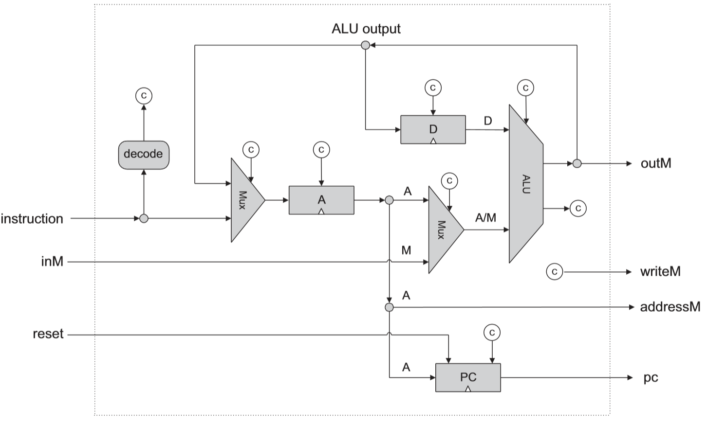

# Nand2Tetris - Hardware (Chapters 1, 2, 3, 5)

This document summarizes the physical layer of the Hack platform.

Table of contents:

- [Nand2Tetris - Hardware (Chapters 1, 2, 3, 5)](#nand2tetris---hardware-chapters-1-2-3-5)
- [Basic Logic Gates](#basic-logic-gates)
    - [Boolean Algebra](#boolean-algebra)
    - [Nand](#nand)
    - [Not](#not)
    - [And](#and)
    - [Or](#or)
    - [Xor](#xor)
    - [Mux](#mux)
    - [DMux](#dmux)
- [Boolean Arithmetic](#boolean-arithmetic)
    - [Two's Complement](#twos-complement)
    - [Half-Adder](#half-adder)
    - [Full-Adder](#full-adder)
    - [ALU](#alu)
- [Sequential Logic](#sequential-logic)
    - [Concepts](#concepts)
    - [DFF](#dff)
    - [Bit](#bit)
    - [Register](#register)
    - [RAM Chips](#ram-chips)
    - [PC (Program Counter)](#pc-program-counter)
- [Computer Architecture](#computer-architecture)
    - [Concepts](#concepts)
    - [CPU](#cpu)
    - [Memory](#memory)
    - [Computer](#computer)
    - [ExtendAlu](#extendalu)
    - [CpuMul](#cpumul)
- [Chips API](#chips-api)

# Basic Logic Gates

## Boolean Algebra

We denote AND operation by $\cdot$, OR by $+$ and NOT by $\overline {\text{overline}}$.

$x$, $y$ and $z$ are boolean _variables_.

- Associativity:
  - $x\cdot y\cdot z = x\cdot (y\cdot z) = (x\cdot y)\cdot z$
  - $x + y + z = x + (y + z) = (x + y) + z$
- Commutativity:
  - $x\cdot y = y\cdot x$
  - $x + y = y + x$
- Distributivity:
  - $x\cdot (y + z) = (x\cdot y) + (x\cdot z)$
  - $x + (y \cdot z) = (x + y) \cdot (x + z)$
- Annihilator:
  - $x\cdot 0 = 0$
  - $x + 1 = 1$
- Identity:
  - $x\cdot 1 = x$
  - $x + 0 = x$
- Idempotence:
  - $x\cdot x = x$
  - $x + x = x$
- Complementation:
  - $x\cdot \bar x = 0$
  - $x + \bar x = 1$
- De Morgan:
  - $\overline{x\cdot y} = \bar x + \bar y$
  - $\overline{x + y} = \bar x \cdot \bar y$
- Double Negation:
  - $\overline {\overline {x}} = x$

## Nand

A NAND gate is an inverted AND gate.

| a | b | out |
|:--|:--|:----|
| 0 | 0 | 1   |
| 0 | 1 | 1   |
| 1 | 0 | 1   |
| 1 | 1 | 0   |

## Not

Implements a logical negation.

| in   | out  |
| :--- | :--- |
| 0    | 1    |
| 1    | 0    |

### Implementation

A NOT gate is made by joining the inputs of a NAND gate together. Since a NAND gate is equivalent to an AND gate followed by a NOT gate, joining the inputs of a NAND gate leaves only the NOT gate. 

```
                  +--------+
    in     +----->|        |   out
    +------+      |  NAND  |+----->
           +----->|        |
                  +--------+
```

## And

| a | b | out |
|:--|:--|:----|
| 0 | 0 | 0   |
| 0 | 1 | 0   |
| 1 | 0 | 0   |
| 1 | 1 | 1   |

Implementation using NAND gates:

```
        +--------+           +--------+  
 a +--->|        |     +---->|        |    out
        |  NAND  |+----+     |  NAND  |+------>
 b +--->|        |     +---->|        |  
        +--------+           +--------+  
```

## Or

| a | b | out |
|:--|:--|:----|
| 0 | 0 | 0   |
| 0 | 1 | 1   |
| 1 | 0 | 1   |
| 1 | 1 | 1   |

Implementation using NAND gates:

```
                  +--------+
           +----->|        |
  a +------+      |  NAND  |+----+
           +----->|        |     |   +--------+
                  +--------+     +-->|        |     out
                                     |  NAND  |+------->
                  +--------+     +-->|        |
           +----->|        |     |   +--------+
  b +------+      |  NAND  |+----+
           +----->|        |
                  +--------+
```

## Xor

| a | b | out |
|:--|:--|:----|
| 0 | 0 | 0   |
| 0 | 1 | 1   |
| 1 | 0 | 1   |
| 1 | 1 | 0   |

Note: `a XOR b := (!a & b) | (!b & a)`

Implementation using NAND gates:

```
                                        +--------+
            +-------------------------->|        |
            |                           |  NAND  |+-----+
            |                   +------>|        |      |
            |   +--------+      |       +--------+      |      +--------+
    a +-----+-->|        |      |                       +----->|        |    out
                |  NAND  |+-----+                              |  NAND  |+------>
    b +-----+-->|        |      |                       +----->|        |
            |   +--------+      |       +--------+      |      +--------+
            |                   +------>|        |      |
            |                           |  NAND  |+-----+
            +-------------------------->|        |
                                        +--------+
```

Derivation:
```
!a * b + !b * a = !(!(!a * b) * !(!b * a))
                = !(!(b * !b + !a * b) * !(a * !a + !b * a))
                = !(!(b * (!a + !b)) * !(a * (!a + !b)))
                = !(!(b * !(a * b)) * !(a * !(a * b)))
```

## Mux

A multiplexer or a MUX gate is a three-input gate that uses one of the inputs, called the selector bit, to select one of the other two inputs, called data bits, and outputs only the selected data bit.

### Truth Table

| a | b | sel | out |
|:--|:--|:----|:----|
| 0 | 0 | 0   | 0   |
| 0 | 0 | 1   | 0   |
| 0 | 1 | 0   | 0   |
| 0 | 1 | 1   | 1   |
| 1 | 0 | 0   | 1   |
| 1 | 0 | 1   | 0   |
| 1 | 1 | 0   | 1   |
| 1 | 1 | 1   | 1   |

### Implementation

Using DNF canonical form the above truth table can be reduced to:
`(sel & b) | (!sel & a)`

Using NAND gates:

```
           sel                             b
            +                              +
            |                              |
         +--+--+----------------------+    |
         |     |                      |    |
         v     v                      v    v
       +---------+                  +--------+
       |         |                  |        |
       |  NAND   |                  |  NAND  |
       |         |                  |        |
       +---------+                  +--------+
            +                           +
            |                           |             +--------+
            |         +--------+        +------------>|        |      out
            +-------->|        |                      |  NAND  |+-------->
                      |  NAND  |+-------------------->|        |
   a +--------------->|        |                      +--------+
                      +--------+
```

## DMux

A demultiplexer performs the opposite function of a multiplexer: It takes a single input and channels it to one of two possible outputs according to a selector bit that specifies which output to choose.

### Truth Table

| in | sel | a | b |
|:---|:----|:--|:--|
| 0  | 0   | 0 | 0 |
| 0  | 1   | 0 | 0 |
| 1  | 0   | 1 | 0 |
| 1  | 1   | 0 | 1 |

### Implementation

`a := in & (!sel)`

`b := in & sel`

Using NAND gates:

```
                                              +--------+            +--------+
            +-------------------------------->|        |     +----->|        |
            |                                 |  NAND  |+----+      |  NAND  |+--------> a
            |                      +--------->|        |     +----->|        |
            |   +--------+         |          +--------+            +--------+
  in +------+-->|        |         |
                |  NAND  |+--------+
 sel +--------->|        |         |          +--------+
                +--------+         |    +---->|        |
                                   +----+     |  NAND  |+---------> b
                                        +---->|        |
                                              +--------+
```

# Boolean Arithmetic

## Two's Complement

- The two's complement of an $n$-bit number $x$ is defined as $2^n - x$.
- Maximum positive number: $2^{n-1} - 1$
- Minimum negative number: $-2^{n-1}$
- In a $16$-bit binary system we can represent integers in the range $-32768$ to $32767$
  for a total of $65536$ values.
- Negating a two's complement number: Invert all the bits and add one to the result.

## Half-Adder

Computes `a+b` and set `sum` and `carry` accordingly.

### Truth Table

| a | b | sum | carry |
|:--|:--|:----|:------|
| 0 | 0 | 0   | 0     |
| 0 | 1 | 1   | 0     |
| 1 | 0 | 1   | 0     |
| 1 | 1 | 0   | 1     |

### Implementation

`sum := a XOR b`

`carry := a AND b`

Using NAND gates:

```
                                        +--------+
            +-------------------------->|        |
            |                           |  NAND  |+-----+
            |                   +------>|        |      |
            |   +--------+      |       +--------+      |      +--------+
    a +-----+-->|        |      |                       +----->|        |    sum
                |  NAND  |+--+--+                              |  NAND  |+------>
    b +-----+-->|        |   |  |                       +----->|        |
            |   +--------+   |  |       +--------+      |      +--------+
            |                |  +------>|        |      |
            |                |          |  NAND  |+-----+
            +----------------(--------->|        |
                             |          +--------+
                             |
                             |          +--------+
                             |    +---->|        |  carry
                             +----+     |  NAND  |+----->
                                  +---->|        |
                                        +--------+
```

## Full-Adder

| a | b | c | sum | carry |
|:--|:--|:--|:----|:------|
| 0 | 0 | 0 | 0   | 0     |
| 0 | 0 | 1 | 1   | 0     |
| 0 | 1 | 0 | 1   | 0     |
| 0 | 1 | 1 | 0   | 1     |
| 1 | 0 | 0 | 1   | 0     |
| 1 | 0 | 1 | 0   | 1     |
| 1 | 1 | 0 | 0   | 1     |
| 1 | 1 | 1 | 1   | 1     |

## ALU

**Input:**
- `x[16]`, `y[16]` - Two 16-bit data values
- `zx` - zero `x`
- `nx` - negate `x`
- `zy` - zero `y`
- `ny` - negate `y`
- `f` - output `x + y` if `f` == 1 else output `x & y`
- `no` - negate output

| zx | nx | zy | ny | f | no | `f`(`x`, `y`) |
|:---|:---|:---|:---|:--|:---|:--------------|
| 1  | 0  | 1  | 0  | 1 | 0  | Constant 0    |
| 1  | 1  | 1  | 1  | 1 | 1  | Constant 1    |
| 1  | 1  | 1  | 0  | 1 | 0  | Constant -1   |
| 0  | 0  | 1  | 1  | 0 | 0  | `x`           |
| 1  | 1  | 0  | 0  | 0 | 0  | `y`           |
| 0  | 0  | 1  | 1  | 0 | 1  | `!x`          |
| 1  | 1  | 0  | 0  | 0 | 1  | `!y`          |
| 0  | 0  | 1  | 1  | 1 | 1  | `-x`          |
| 1  | 1  | 0  | 0  | 1 | 1  | `-y`          |
| 0  | 1  | 1  | 1  | 1 | 1  | `x+1`         |
| 1  | 1  | 0  | 1  | 1 | 1  | `y+1`         |
| 0  | 0  | 1  | 1  | 1 | 0  | `x-1`         |
| 1  | 1  | 0  | 0  | 1 | 0  | `y-1`         |
| 0  | 0  | 0  | 0  | 1 | 0  | `x+y`         |
| 0  | 1  | 0  | 0  | 1 | 1  | `x-y`         |
| 0  | 0  | 0  | 1  | 1 | 1  | `y-x`         |
| 0  | 0  | 0  | 0  | 0 | 0  | `x&y`         |
| 0  | 1  | 0  | 1  | 0 | 1  | `x\|y`        |

**Output Flags:**
- `zr` - Zero flag. 1 iff `out` == 0
- `ng` - Negative flag. 1 iff `out` < 0

# Sequential Logic

## Concepts

- **Sequential Logic** is a type of logic circuit whose output depends not only on the present
  value of its input signals but on the sequence of past inputs.
- Sequential Logic has state (_memory_) while combinational logic does not.
- A _clock_ is an electronic occilator that generates a sequence of repetitive pulses called
  the clock signal which is distributed to all the memory elements in the circuit.
- The basic memory element in sequential logic is the _flip-flop_.
-  The interval between clock pulses must be long enough so that all the logic gates have time
  to respond to the changes and their outputs "settle" to stable logic values, before the next
  clock pulse occurs.
- The maximum possible clock rate is determined by the slowest logic path in the circuit,
  otherwise known as the critical path. This is considered a disadvantage to synchronous logic.

### HDL Considerations

- On a _tick_, the hardware simulator read all input pins and goes through all the internal
  chip logic.

  On a _tock_, the hardware simulator update the output pins of all clocked chips.
- CLOCKED input pin $x$ meaning that any of the chip's output pins isn't going to affect $x$    until the beginning of the next time unit (_tock_).
  
  CLOCKED output pin $x$ means that any of the chip's input pins isn't going to affect $x$ until the beginning of the next time unit (_tock_).
- Feedback loops are valid in HDL if and only if there is a CLOCKED pin somewhere along
  the loop.

## DFF

- Stands for _Data Flip-Flop_.
- A flip-flop is a device which stores a single bit (binary digit) of data.
- Chip Operation: out(t) = in(t-1)
- Note that the `in` pin is defined as CLOCKED by HDL.

## Bit

1-bit register.

```
 in     +-------+
 +----->|       |    out
        |  Bit  |+------>
 +----->|       |
 load   +-------+
```

Implements the following logic:
```
if load(t) == 1 then out(t+1) = in(t)
                else out(t+1) = out(t) // out does not change
```

## Register

16-bit register with the same logic as the `Bit` chip.


## RAM Chips

All RAM chips present the same API: a 16-bit input (`in[16]`), `load` bit and variable-length `address[len]`. The chip outputs the selected register data on each time unit.

| Chip Name | Number of Registers | Address Bits |
|:----------|:--------------------|:-------------|
| RAM8      | 8                   | 3            |
| RAM64     | 64                  | 6            |
| RAM512    | 512                 | 9            |
| RAM4K     | 4096                | 12           |
| RAM16K    | 16384               | 14           |


## PC (Program Counter)

A 16-bit counter with load and reset control bits.
```
if      (reset(t) == 1) out(t+1) = 0
else if (load(t) == 1)  out(t+1) = in(t)
else if (inc(t) == 1)   out(t+1) = out(t) + 1  (integer addition)
else                    out(t+1) = out(t)
```

# Computer Architecture

## Concepts

- A **stored-program computer** is a computer that stores program instructions in electronic memory.
- The **von Neumann architecture** describes a design architecture for an electronic digital computer with:
  - A **processing unit** that contains an **arithmetic logic unit** and processor **registers**
  - A **control unit** that contains an instruction register and program counter
  - **Memory** that stores data and instructions
  - External mass storage
  - Input and output mechanisms
- The shared bus between the program memory and data memory leads to the *von Neumann bottleneck*, the limited throughput (data transfer rate) between the CPU and memory.
- The most obvious characteristic of the **Harvard Architecture** is that it has physically separate signals and storage for code and data memory.
  - It is possible to access program memory and data memory simultaneously. 
  - Typically, code (or program) memory is read-only and data memory is read-write.

```
von Neumann architecture scheme:
                     +-------------------------------+
                     |                               |
                     |  +-------------------------+  |
                     |  | Central Processing Unit |  |
                     |  |-------------------------|  |
                     |  |  +-------------------+  |  |
                     |  |  |   Control Unit    |  |  |
                     |  |  |                   |  |  |
                     |  |  +-------------------+  |  |
 +--------------+    |  |                         |  |    +---------------+
 |              |    |  |  +-------------------+  |  |    |               |
 | Input Device |+-->|  |  | Arithmetic Logic  |  |  |+-->| Output Device |
 |              |    |  |  | Unit              |  |  |    |               |
 +--------------+    |  |  +-------------------+  |  |    +---------------+
                     |  +-------------------------+  |
                     |         ^          +          |
                     |         |          |          |
                     |         +          v          |
                     |  +-------------------------+  |
                     |  |         Memory          |  |
                     |  |          Unit           |  |
                     |  +-------------------------+  |
                     +-------------------------------+
```

## CPU

- Designed to execute 16-bit instructions according to Hack machine language.
- Connected to the instruction memory (**ROM32K** chip) and to the data memory (**Memory** chip).
- Has two built-in registers:
    - **ARegister** - Addressing / Data register.
    - **DRegister** - Data register.

### Interface

- `inM` - contains RAM[A]
- `instruction` - the current instruction
- `reset` - reset button
- `outM` - RAM[A] if writeM equals 1, otherwise undefined.
- `writeM` - 1 if the instruction is C-instruction and the 'dest' field specifies 'M'.
- `addressM` - the contents of the A register.
- `pc` - the address of the next instruction.


### Implementation Skeleton



## Memory

- The Memory chip refers to the *data memory* (read/write memory) not to read-only memory.
- `address` is 15-bits
- Toal number of registers: 24577 = 16384 + 8192 + 1

```
    0  +----------------------------+
       |                            |
       |                            |
       |                            |
       |                            |
       |                            |
       |                            |
       |          RAM (16K)         |
       |                            |
       |                            |
       |                            |
       |                            |
 16383 |                            |
 16384 +----------------------------+
       |                            |
       |                            |
       |     Screen Memory Map      |
       |                            |
       |            (8K)            |
       |                            |
 24575 |                            |
 24576 +----------------------------+
       |   Keyboard Memory Map (1)  |
       +----------------------------+
```


## Computer


## ExtendAlu

- Extension to the standard ALU, support multiplication and shifting.
- The standard ALU recieves 6 flags which constitues the instruction: zx, nx, zy, ny, f, no.
- The extended ALU recieves 9 flags with input called `instruction[9]`.
- The behavior of the extended chip is as follows:
  - if `instruction[7] == 1 && instruction[8] == 1` then the output is exactly as the standard ALU,
  where `zx := instruction[5], nx := instruction[4], ..., no := instruction[0]`.
  - else if `instruction[7] == 0` the output will be `x*y` (multiplication).
  - else the output will be shift:
    - if `instruction[5] == 0` it will return shift right, otherwise shift left.
    - if `instruction[4] == 0` it will return shift of y, otherwise shift of x.
- `instruction[6]` is unused in the extended ALU.
- The `ng` and `zr` pins behave the same as in the standard ALU.


## CpuMul

- This chip is an extension of the standard CPU, and it is utilizing the extended ALU.
- if `instruction[15] == 0 || (instruction[14] == 1 && instruction[13] == 1)` then the chip behaves exactly like the standard CPU.
- if the current instruction is a C instruction and `instruction[13] == 0` the output will be `D*A` or `D*M`
(the choice between multiplying D by A or M is according to `instruction[12]`).
- if the current instruction is a C instruction and `instruction[14] == 0` it will behave as describe by the following table (numbers are the instruction bits).

  | Function    | 15 (opcode) | 14 | 13 | 12 (a) | 11 (c1) | 10 (c2) |
  |:------------|:------------|:---|:---|:-------|:--------|:--------|
  |D*A          | 1           | 1  | 0  | 0      | ?       | ?       |
  |D*M          | 1           | 1  | 0  | 1      | ?       | ?       |
  |ShiftLeft D  | 1           | 0  | 1  | ?      | 1       | 1       |
  |ShiftLeft A  | 1           | 0  | 1  | 0      | 1       | 0       |
  |ShiftLeft M  | 1           | 0  | 1  | 1      | 1       | 0       |
  |ShiftRight D | 1           | 0  | 1  | ?      | 0       | 1       |
  |ShiftRight A | 1           | 0  | 1  | 0      | 0       | 0       |
  |ShiftRight M | 1           | 0  | 1  | 1      | 0       | 0       |

- Bits number 14 and 13 control the extended behavior:
  -  14: 0 for **shift**
  -  13: 0 for **multiplication**
-  Bit number 12 control which input is fed to the ALU: 0 for A register, 1 for M register.
-  Bits number 11 and 10 control the shifting behavior (have no impact in multiplication mode):
   - 11: **(shift direction)** 0 for shift right, 1 for shift left.
   - 10: **(shift input)** 0 for shift y, 1 for shift x.

> Notes:
> - Behavior is undefined if both bit 14 and 13 equals 0.
> - Since `instruction[6]` of the chip ExtendAlu is unused, we can pass the bits of the C-Instruction `instruction[6..14]` directly to ExtendAlu `instruction` input.

# Chips API

This list contains the _Hack_ chip set API along with a small description. Chips are ordered by their construction order.

List syntax: **ChipName** `(in1, in2) -> out1, out2`: _Optional Description_

- **Nand** `(a, b) -> out`: _Basic NAND logic gate_
- **Not** `(in) -> out`
- **And** `(a, b) -> out`
- **Or** `(a, b) -> out`
- **Mux** `(a, b, sel) -> out`: _Output `a` if `sel` is 0, otherwise, outputs `b`_
- **DMux** `(in, sel) -> a, b`: _Set `a` to `in` if `sel` equals 0, otherwise, set `b` to `in`_
- **Not16** `(in[16]) -> out[16]`: _Setting `out[i]` to NOT `in[i]`_
- **And16** `(a[16], b[16]) -> out[16]`: _Setting `out[i]` to `a[i]` AND `b[i]`_
- **Or16** `(a[16], b[16]) -> out[16]`: _Setting `out[i]` to `a[i]` OR `b[i]`_
- **Mux16** `(a[16], b[16], sel) -> out[16]`
- **Or8Way** `(in[8]) -> out`: _Performing OR(`in[0]`,...,`in[7]`)_
- **Mux4Way16** `(a[16], b[16], c[16], d[16], sel[2]) -> out[16]`
- **Mux8Way16** `(a[16], b[16], c[16], d[16], e[16], f[16], g[16], h[16], sel[3]) -> out[16]`
- **DMux4Way** `(in, sel[2]) -> a, b, c, d`
- **DMux8Way** `(in, sel[3]) -> a, b, c, d, e, f, g, h`
- **HalfAdder** `(a, b) -> sum, carry`: _Setting `sum` to `a` XOR `b` and `carry` to `a` AND `b`_
- **FullAdder** `(a, b, c) -> sum, carry`
- **Add16** `(a[16], b[16]) -> out[16]`: Computes `a+b` modulo $2^{16}$
- **Inc16** `(in[16]) -> out[16]`: _16-bit incrementer_
- **Mul** `(a[16], b[16]) -> out[16]`: _Multiply two numbers (keep sign)_
- **ShiftLeft** `(in[16]) -> out[16]`: _Multiply by 2 (keep sign)_
- **ShiftRight** `(in[16]) -> out[16]`: _Divide by 2 (keep sign)_
- **ALU** `(x[16], y[16], zx, nx, zy, ny, f, no) -> out[16], zr, ng`: _Arithmetic Logic Unit_
- **DFF** `(in) -> out:` _Sequential chip that performs: out(t)=in(t-1)_
- **Bit** `(in, load) -> out`: _out(t) = out(t-1) if load==0 else in(t-1)_
- **Register** `(in[16], load) -> out[16]`: _16-Bit register_
- **RAM8** `(in[16], load, address[3]) -> out[16]`: _Memory of 8 registers, each 16 bit-wide_
- **RAM64** `(in[16], load, address[6]) -> out[16]`: _Memory of 64 registers (composed of 8 RAM8 chips)_
- **RAM512** `(in[16], load, address[9]) -> out[16]`
- **RAM4K** `(in[16], load, address[12]) -> out[16]`
- **RAM16K** `(in[16], load, address[14]) -> out[16]`
- **PC** `(in[16], inc, load, reset) -> out[16]`: _Program counter_
- **Screen** `(in[16], load, address[13]) -> out[16]`: _8K registers 256 rows with 512 pixels each_
- **Keyboard** `() -> out[16]`: _Outputs the code of the key presently pressed on the physical keyboard_
- **ROM32K** `(address[15]) -> out[16]`: _Read-Only memory (ROM) of 32K registers, each 16-bit wide_
- **Memory** `(in[16], load, address[15]) -> out[16]`: _Hack entire data memory_
- **CPU** `(inM[16], instruction[16], reset) -> outM[16], writeM, addressM[15], pc[15]`: _Executes the instruction according to specification_
- **Computer** `(reset) -> `: _Topmost chip_
- **ExtendAlu** `(x[16], y[16], instruction[9]) -> out[16], zr, ng`: _Support the usual operations, as well as multiplication and shifting_
- **CpuMul** `(inM[16], instruction[16], reset) -> outM[16], writeM, addressM[15], pc[15]`: _Support instructions that involves multiplication and shifting_
