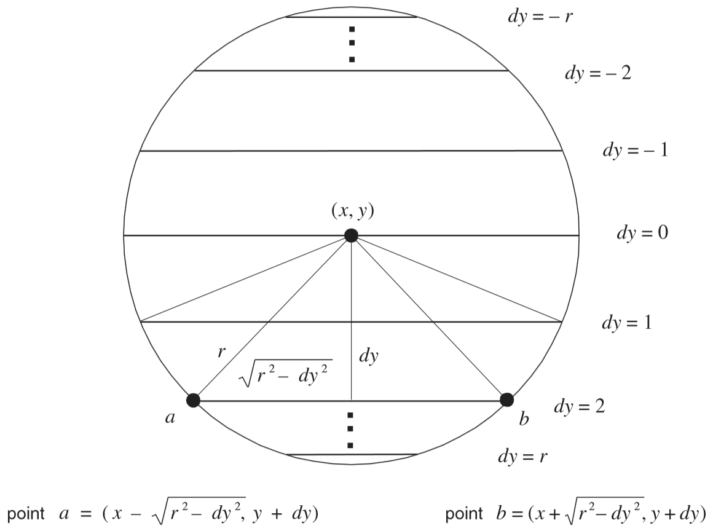

# Nand2Tetris - OS (Chapter 12)

This document describe the OS that accompanies the Jack programming language and the Hack platform.

- [Nand2Tetris - OS (Chapter 12)](#nand2tetris---os-chapter-12)
- [OS API](#os-api)
    - [Math](#math)
    - [String](#string)
    - [Array](#array)
    - [Output](#output)
    - [Screen](#screen)
    - [Keyboard](#keyboard)
    - [Memory](#memory)
    - [Sys](#sys)
    - [Error Codes](#error-codes)
- [Selected Algorithms](#selected-algorithms)
    - [Integer Division](#integer-division)
    - [Integer Square Root](#integer-square-root)
    - [Integer to String](#integer-to-string)
    - [Memory Management](#memory-management)
    - [Graphics](#graphics)
    - [Print Char](#print-char)

# OS API

## Math

This class enables various mathematical operations.
- `function void init()`: for internal use only
- `function int abs(int x)`: returns the absolute value of x
- `function int multiply(int x, int y)`: returns the product of x and y
- `function int divide(int x, int y)`: returns the integer part of x/y
- `function int min(int x, int y)`: returns the minimum of x and y
- `function int max(int x, int y)`: returns the maximum of x and y
- `function int sqrt(int x)`: returns the integer part of the square root of x

## String

This class implements the String data type and various string-related operations.
- `constructor String new(int maxLength)`: constructs a new empty string (of length
zero) that can contain at most maxLength characters
- `method void dispose()`: disposes this string
- `method int length()`: returns the length of this string
- `method char charAt(int j)`: returns the character at location j of this string
- `method void setCharAt(int j, char c)`: sets the j-th element of this string to c
- `method String appendChar(char c)`: appends c to this string and returns this
string
- `method void eraseLastChar()`: erases the last character from this string
- `method int intValue()`: returns the integer value of this string (or the string prefix until a non-digit character is detected)
- `method void setInt(int j)`: sets this string to hold a representation of j
- `function char backSpace()`: returns the backspace character
- `function char doubleQuote()`: returns the double quote (") character
- `function char newLine()`: returns the newline character

## Array

This class enables the construction and disposal of arrays.
- `function Array new(int size)`: constructs a new array of the given size
- `method void dispose()`: disposes this array

## Output

This class allows writing text on the screen.

In textual mode, the *Hack* screen platform is composed of 23 rows each with 64 chars.

The *Hack* font is 8-bit wide and 11-bit high, with two column spacing between each character, and 1 row spacing.

- `function void init()`: for internal use only
- `function void moveCursor(int i, int j)`: moves the cursor to the j-th column of the
i-th row, and erases the character displayed there
- `function void printChar(char c)`: prints c at the cursor location and advances the
cursor one column forward
- `function void printString(String s)`: prints s starting at the cursor location and
advances the cursor appropriately
- `function void printInt(int i)`: prints i starting at the cursor location and advances the cursor appropriately
- `function void println()`: advances the cursor to the beginning of the next line
- `function void backSpace()`: moves the cursor one column back

## Screen

This class allows drawing graphics on the screen. Column indices start at 0 and
are left to right. Row indices start at 0 and are top to bottom. The screen size is
hardware-dependant (in the Hack platform: 256 rows by 512 columns).

- `function void init()`: for internal use only
- `function void clearScreen()`: erases the entire screen
- `function void setColor(boolean b)`: sets a color (white = false, black = true) to
be used for all further drawXXX commands
- `function void drawPixel(int x, int y)`: draws the (x, y) pixel
- `function void drawLine(int x1, int y1, int x2, int y2)`: draws a line from pixel
(x1, y1) to pixel (x2, y2)
- `function void drawRectangle(int x1, int y1, int x2, int y2)`: draws a filled rectangle whose top left corner is (x1, y1) and whose bottom right corner is (x2, y2)
- `function void drawCircle(int x, int y, int r)`: draws a filled circle of radius
r <= 181 around (x, y)

## Keyboard

This class allows reading inputs from a standard keyboard.
- `function void init()`: for internal use only;
- `function char keyPressed()`: returns the character of the currently pressed key
on the keyboard; if no key is currently pressed, returns 0.
- `function char readChar()`: waits until a key is pressed on the keyboard and released, then echoes the key to the screen and returns the character of the pressed key
- `function String readLine(String message)`: prints the message on the screen, reads
the line (text until a newline character is detected) from the keyboard, echoes the line
to the screen, and returns its value. This function also handles user backspaces.
- `function int readInt(String message)`: prints the message on the screen, reads the
line (text until a newline character is detected) from the keyboard, echoes the line to
the screen, and returns its integer value (until the first non-digit character in the line
is detected). This function also handles user backspaces.

## Memory

This class allows direct access to the main memory of the host platform.
- `function void init()`: for internal use only
- `function int peek(int address)`: returns the value of the main memory at this
address
- `function void poke(int address, int value)`: sets the contents of the main memory
at this address to value
- `function Array alloc(int size)`: finds and allocates from the heap a memory block
of the specified size and returns a reference to its base address
- `function void deAlloc(Array o)`: De-allocates the given object and frees its
memory space

## Sys

This class supports some execution-related services.
- `function void init()`: calls the init functions of the other OS classes and then
calls the Main.main() function. For internal use only.
- `function void halt()`: halts the program execution
- `function void error(int errorCode)`: prints the error code on the screen and halts
- `function void wait(int duration)`: waits approximately duration milliseconds and
returns

## Error Codes

| Code | Method/Function      | Description                                     |
| ---- | -------------------- | ----------------------------------------------- |
| 1    | Sys.wait             | Duration must be positive                       |
| 2    | Array.new            | Array size must be positive                     |
| 3    | Math.divide          | Division by zero                                |
| 4    | Math.sqrt            | Cannot compute square root of a negative number |
| 5    | Memory.alloc         | Allocated memory size must be positive          |
| 6    | Memory.alloc         | Heap overflow                                   |
| 7    | Screen.drawPixel     | Illegal pixel coordinates                       |
| 8    | Screen.drawLine      | Illegal line coordinates                        |
| 9    | Screen.drawRectangle | Illegal rectangle coordinates                   |
| 12   | Screen.drawCircle    | Illegal center coordinates                      |
| 13   | Screen.drawCircle    | Illegal radius                                  |
| 14   | String.new           | Maximum length must be non-negative             |
| 15   | String.charAt        | String index out of bounds                      |
| 16   | String.setCharAt     | String index out of bounds                      |
| 17   | String.appendChar    | String is full                                  |
| 18   | String.eraseLastChar | String is empty                                 |
| 19   | String.setInt        | Insufficient string capacity                    |
| 20   | Output.moveCursor    | Illegal cursor location                         |

# Selected Algorithms

## Integer Division

### Description

Given two integers `x >= 0` and `y > 0` we'd like to compute the integer part of `x/y`.

We start by recursively divide `x` by `2y`, and store the result in `q`.

The remainder `x - q*(2y)` satisfies:
```
0 <= x - q * (2y) < 2y
```

If `x - q*(2y) < y` we found our answer, and the quotient is `2q`.

If `y <= x - q*(2y) < 2y` then we can subtract `y` one more time, and the quotient is `2q+1`.

### Implementation

```c
int divide(int x, int y) {
    if (x < y) {
        return 0;
    }

    int q = divide(x, 2 * y);
    if (x - q * (2 * y) < y) {
        return 2 * q;
    }
    return 2 * q + 1;
}
```

Handling overflows:

The variable `y` can overflow, thus we overwrite the base case:

```
if (x < y || y < 0) {
    return 0;
}
```
<!-- 
Useful links from project12 forum

- http://nand2tetris-questions-and-answers-forum.32033.n3.nabble.com/Addition-only-variant-of-division-algorithm-td4025438.html
- http://nand2tetris-questions-and-answers-forum.32033.n3.nabble.com/How-can-2-q-y-be-computed-without-multiplication-in-divide-algorithm-td4028051.html
- http://nand2tetris-questions-and-answers-forum.32033.n3.nabble.com/Derivation-of-the-recursive-division-algorithm-td4032310.html

-->

## Integer Square Root

```python
def isqrt(x):
    y = 0   # The result
    i = 7   # The power

    while i >= 0:
        if (y + 2 ** i) ** 2 <= x:
            y += 2 ** i
        i -= 1

    return y
```

To handle overflows add a check:
```python
if 0 < (y + 2 ** i) ** 2 <= x:
    ...
```

<!--
Useful links:

http://nand2tetris-questions-and-answers-forum.32033.n3.nabble.com/A-more-efficient-square-root-algorithm-td4028140.html
-->

## Integer to String

```c
char *itoa(int x, char[] s) {
    if (x < 10) {
        *s++ = x + '0';
        return s;
    }
    s = itoa(x / 10, s);
    *s++ = x % 10 + '0';
    *s = '\0';
    return s;
}
```

## Memory Management

**Heap Address Space:** 2048 - 16383 (Total Registers: 14336)

### Allocation

- Maintaining a `freeList` - linked list of all free blocks in the heap.

  At boot, `freeList` containing one contiguous block with length 14336.
- let `node` be a node in the `freeList`, then:
  - `node[0]` store the *length* of the free block
  - `node[1]` point to the next node
- When servicing a call `alloc(size)` we search the `freeList` for node whose length is at least `size+1` (+1 for storing the `length` field).
- We calculate the new length of the block by: `new_length = node[length] - (size + 1)`
- If `new_length` is 0, 1 or 2 then the remaining block is too small and therefore, the entire node is deleted from the `freeList`.
- Otherwise, we calculate the address of the new block: `block = node + new_length + 1`,
  
  and set the block size for future reference: `block[-1] = size + 1`

### Deallocation

- Simply add the given block address (`block - 1`) to the head of the `freeList`.

## Graphics

### Draw Pixel

Given a coordinate `(x, y)` on the screen, where `0 <= x < 512` and `0 <= y < 256`, we draw it using:
```c
int reg = y * 32 + x / 16;
int bit = x % 16;
if (color == BLACK) { // Turn 'bit' on
    screen[reg] = screen[reg] | twoToThe[bit];
} else { // Turn 'bit' off
    screen[reg] = screen[reg] & (~twoToThe[bit]);
}
```

Tip - efficient modulo calculation for powers of two:

We can compute `x % 16` efficiently using the following insight, describes with an example:
```
  0110100001001110        // 26702
& 0000000000001111        // 16-1=15
  ----------------
  0000000000001110        // 14
```

This effectively eliminates all the "high order" bits, in the binary representation.

### Draw Line

Given two coordinates `(x1, y1)` and `(x2, y2)` we'd like to draw a straight line between them.
We assume `y1 >= y2`.

```c
int dx, dy;
dx = abs(x2 - x1);
dy = y1 - y2;

int a, b;
a = b = 0;

int diff = 0; // a * dy - b * dx
while (a <= dx && b <= dy) {
    // Decide which direction to draw based on x1 and x2 relation
    if (x1 <= x2) {
        drawPixel(x + a, y - b);
    } else {
        drawPixel(x - a, y - b);
    }
    
    // Correct undershooting or overshooting
    if (diff < 0) {
        a++;
        diff += dy;
    } else {
        b++;
        diff -= dx;
    }
}
```

Here is instructive image (important to note that the image axis system is different from the algorithm implementation above):

")

### Draw Circle

Simple Jack implementation:
```
let dy = -r;

while (dy < (r + 1)) {
    let offset = Math.sqrt((r * r) - (dy * dy));
    do Screen.drawLine(x - offset, y + dy, x + offset, y + dy);
    let dy = dy + 1;
}
```

> Note: the circle drawing algorithm may cause overflow if `r` is greater than 181.

Figure:



## Print Char

The function `Output.printChar(c)` takes a single character `c` and prints it onto the screen at the current cursor position.

- If `c` is non-printable character (ascii value greater than 126 or less than 32), then a black square is printed.
- If `c` is a new line character (in the *Hack* its value equals 128), then move the cursor to the beginning of the next line (in circular fashion if it is the last line).
- If `c` is a backspace (129 in *Hack*) then move the cursor one column to the left.
- Otherwise, retrieve the font (using the private function `Output.getMap`) and print it onto the screen.
  
  The naive approach is to utilize Output.drawLine, but it turns out we can examine, based on the cursor location, if the pixels that should be overwritten are the 8 low bits of the respected word or 8 high bits, and manipulate half-word to draw the font.